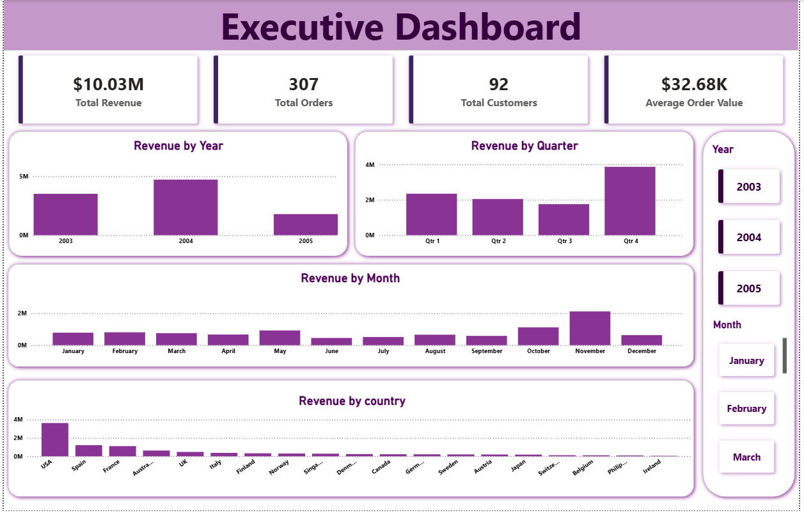
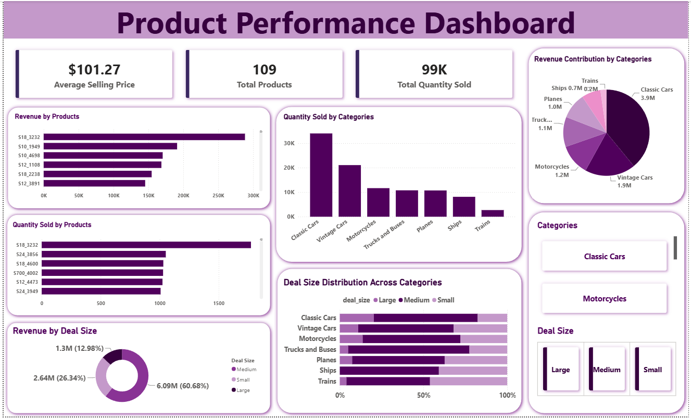
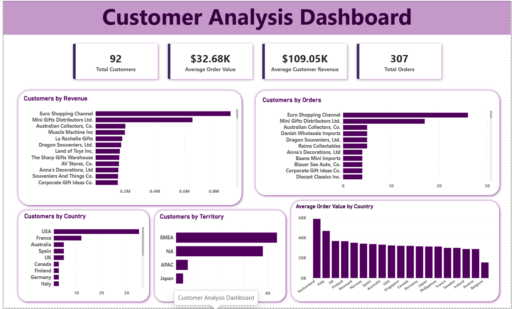
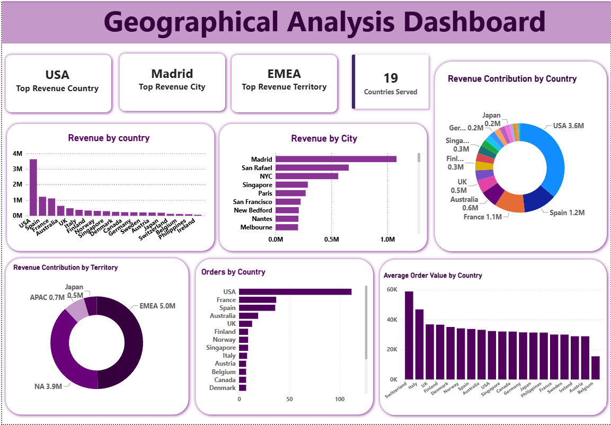
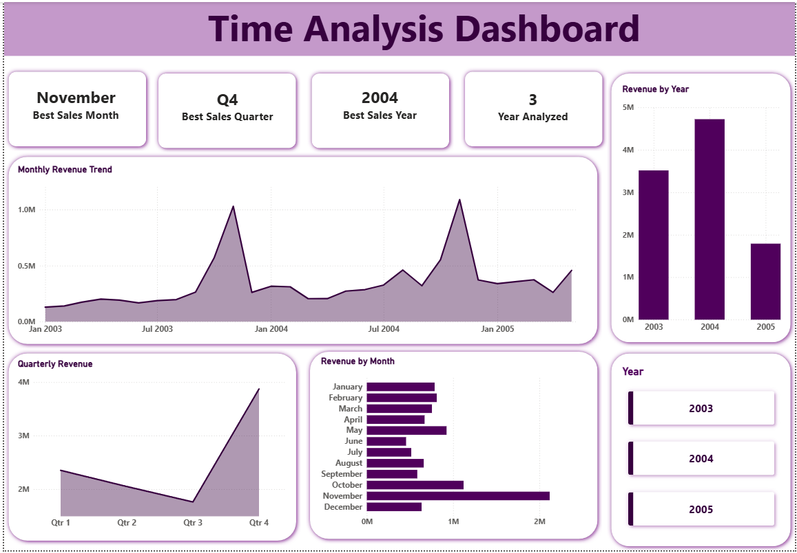

# 📊 Sales Analytics Project

## 📌 Overview

This project is an end-to-end **Sales Analytics** solution built using **SQL, Python, and Power BI**. It transforms raw sales data into meaningful business insights through data normalization, SQL analysis, Python validation, and interactive dashboards.

The project demonstrates the complete analytics workflow, from data preparation to executive reporting.

---

# 🚀 Objectives

The project answers key business questions such as:

- Which products generate the highest revenue?
- Which customers contribute the most sales?
- Which countries and territories perform best?
- How do sales change over time?
- Which deal sizes dominate product sales?
- What are the key revenue trends across categories?

---

# 🛠️ Tech Stack

- **SQL (MySQL)** – Data modeling, normalization, business analysis
- **Python**
  - Pandas
  - Matplotlib
- **Power BI** – Interactive dashboards
- **Jupyter Notebook**
- **VS Code**

---

# 📂 Project Structure

```
SALES-ANALYTICS-PROJECT
│
├── data
│   ├── raw
│   │   └── sales_data.csv
│   │
│   └── processed
│       ├── Categories.csv
│       ├── Customers.csv
│       ├── Orders.csv
│       ├── Orders_Details.csv
│       └── Products.csv
│
├── docs
│   └── Data_Dictionary.md
│
├── notebooks
│   └── Sales_Analytics.ipynb
│
├── powerbi
│   ├── all_sales_analytics_dashboard.pbix
│   ├── executive_dashboard.png
│   ├── product_dashboard.png
│   ├── customer_dashboard.png
│   ├── geographic_dashboard.png
│   └── time_dashboard.png
│
├── reports
│   ├── Executive_Dashboard.md
│   ├── Product_Performance.md
│   ├── Customer_Analysis.md
│   ├── Geographic_Analysis.md
│   └── Time_Analysis.md
│
├── sql
│   ├── analysis
│   ├── 01_create_database.sql
│   ├── 02_create_tables.sql
│   ├── 03_create_staging_table.sql
│   ├── 04_load_data.md
│   └── 05_normalize_data.sql
│
├── README.md
├── LICENSE
└── .gitignore
```

---

# 🗄 Database Design

The raw sales dataset was normalized into a relational database consisting of five tables:

- Customers
- Orders
- Order Details
- Products
- Categories

Relationships were created using primary and foreign keys to eliminate redundancy and improve query performance.

---

# 📈 SQL Analysis

The project contains multiple SQL reports covering different business domains.

### Executive Dashboard

- Total Revenue
- Total Orders
- Total Customers
- Average Order Value

---

### Product Performance

- Highest Revenue Products
- Best Selling Products
- Revenue by Category
- Quantity by Category
- Deal Size Analysis
- Pareto (80/20) Analysis
- Revenue Contribution by Category

---

### Customer Analysis

- Top Revenue Customers
- Top Customers by Orders
- Average Order Value
- Customer Revenue Distribution
- Country-wise Customer Analysis

---

### Geographic Analysis

- Revenue by Country
- Revenue by City
- Revenue by Territory
- Orders by Country
- Average Order Value by Country

---

### Time Analysis

- Monthly Revenue Trend
- Quarterly Revenue
- Yearly Revenue
- Monthly Growth Analysis
- Seasonality Analysis

---
# 📊 Power BI Dashboards

The project includes five interactive dashboards built in **Power BI**.

---

## 1. Executive Dashboard

Provides an overview of overall business performance through key KPIs and sales trends.



---

## 2. Product Performance Dashboard

Analyzes product revenue, category performance, deal size distribution, and best-selling products.



---

## 3. Customer Analysis Dashboard

Explores customer purchasing behavior, top customers, order value, and geographic customer distribution.



---

## 4. Geographic Analysis Dashboard

Analyzes revenue by country, city, and territory to identify regional sales performance.



---

## 5. Time Analysis Dashboard

Tracks monthly, quarterly, and yearly sales trends along with seasonality.



---

### 📁 Power BI Files

- **Dashboard File:** `powerbi/all_sales_analytics_dashboard.pbix`
- **Dashboard Screenshots:** `powerbi/`

---

# 📓 Python Analysis

Python was used for:

- Data validation
- Exploratory Data Analysis (EDA)
- Data quality checks
- Visualizations

> **Note:** The visualizations referenced in the analysis reports were created inside the Jupyter Notebook.

---

# 💡 Key Business Insights

- Classic Cars generated the highest revenue among all product categories.
- Product ID 40 was the highest revenue-generating product.
- Medium deal size dominated sales across every product category.
- Euro Shopping Channel generated the highest customer revenue.
- USA contributed the highest overall sales revenue.
- Madrid was the highest revenue-generating city.
- EMEA was the best-performing sales territory.
- Quarter 4 produced the highest revenue.
- Approximately 74 products generated nearly 80% of total company revenue (Pareto Principle).

---

# 📚 Skills Demonstrated

- SQL Database Design
- Data Normalization
- Joins
- Common Table Expressions (CTEs)
- Window Functions
- Ranking Functions
- Aggregations
- Business KPI Development
- Data Cleaning
- Exploratory Data Analysis
- Power BI Dashboard Development
- Business Storytelling

---

# 🔮 Future Improvements

- Sales Forecasting
- Customer Lifetime Value (CLV)
- RFM Analysis
- Inventory Optimization
- Predictive Analytics using Machine Learning

---

# 👤 Author

**Aruna Naik**

Aspiring Data Analyst

**Skills**

- SQL
- Python
- Power BI
- Excel

---
> 📖 For detailed installation and setup instructions, refer to **[setup.md](setup.md)**.
---

⭐ If you found this project useful, consider giving it a star.
