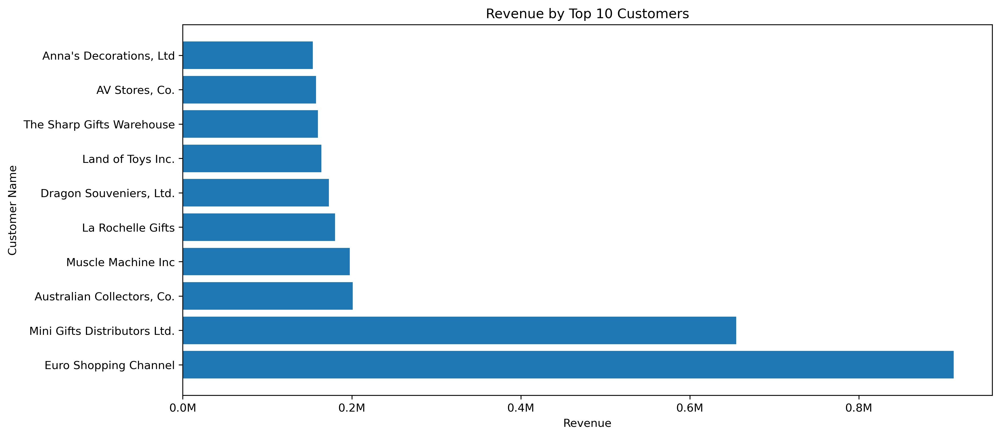
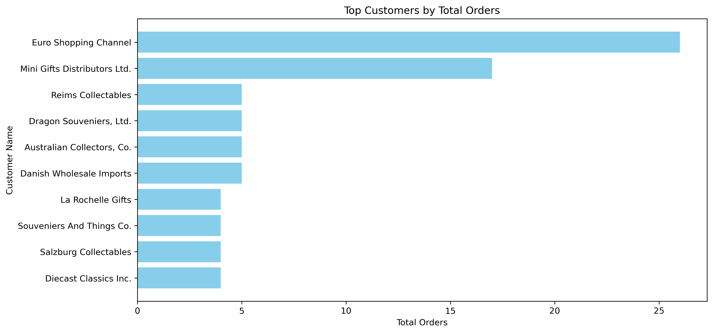
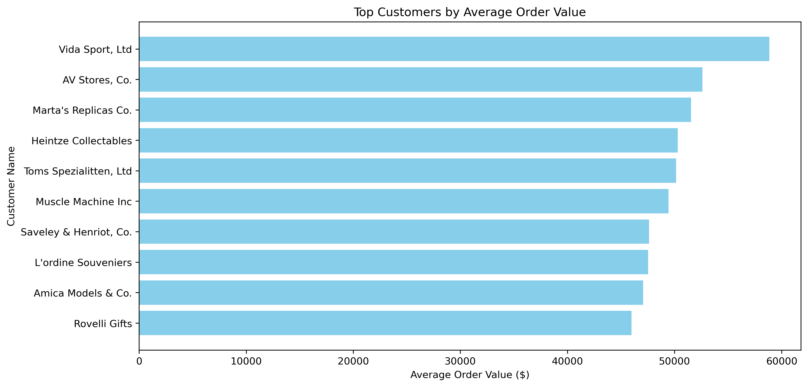
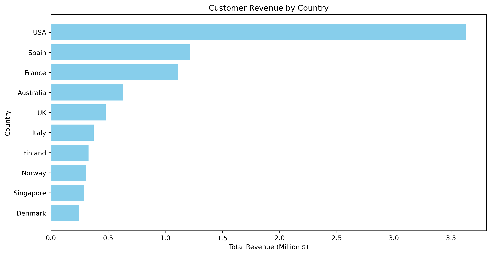
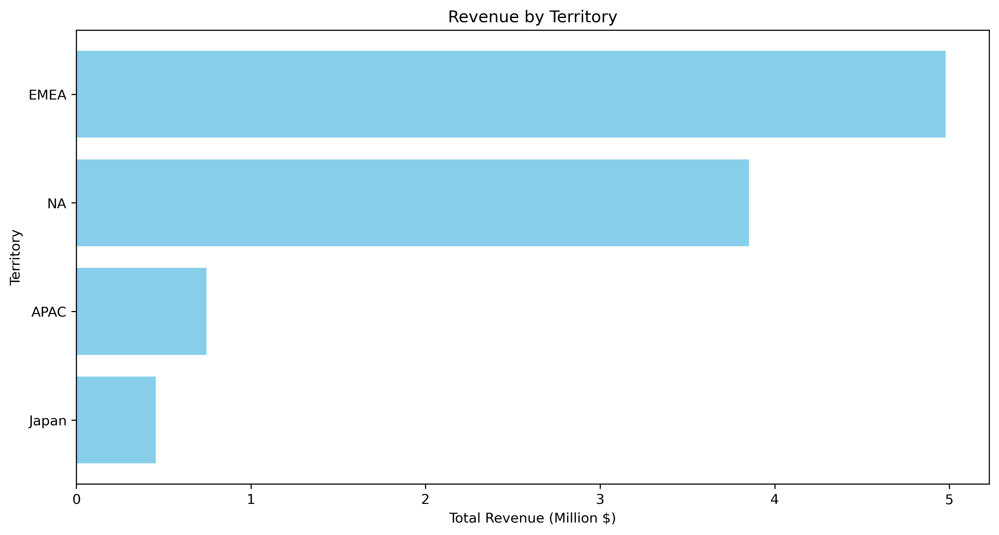
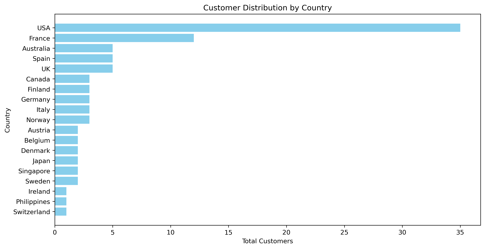
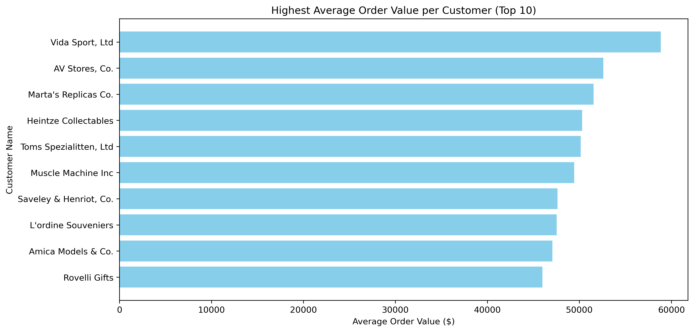
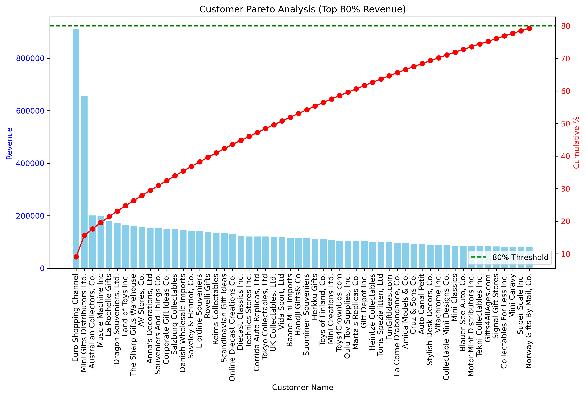
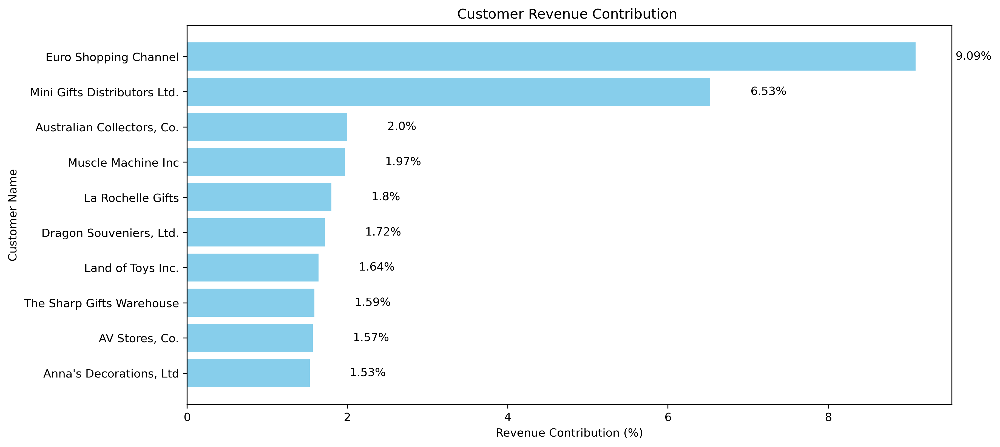
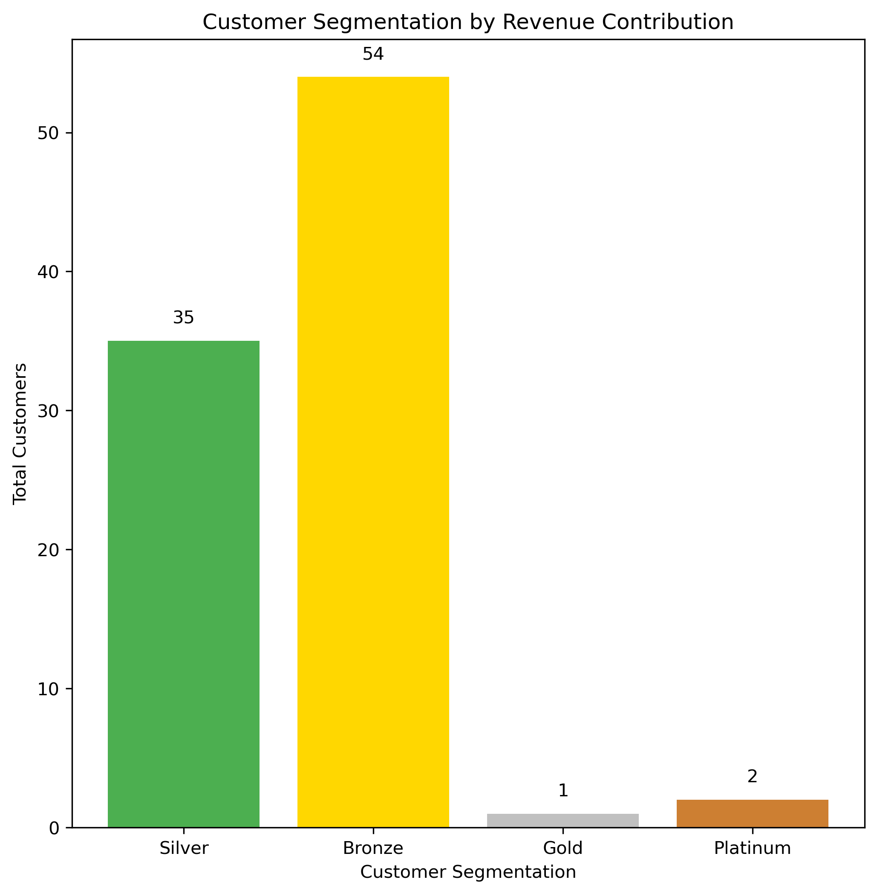

# Customer Sales Analysis Report

## Project Overview

The Customer Sales Analysis evaluates customer purchasing behavior, regional performance, customer concentration, and customer value. The analysis identifies the company's most valuable customers, strongest geographical markets, and customer spending patterns to support customer relationship management and revenue growth strategies.

The insights generated from this report help management improve customer retention, optimize regional sales strategies, and prioritize high-value customers.

---

# Executive Summary

The company generated over **$10 million** in sales from **92 active customers**, with a relatively small group of customers contributing the majority of total revenue.

**Euro Shopping Channel** emerged as the highest revenue-generating customer, while **Vida Sport Ltd** recorded the highest average order value. Revenue is highly concentrated among a limited number of customers, confirming the Pareto Principle where approximately **56 customers generate nearly 80% of total company revenue**.

Geographically, the **United States** remains the largest revenue-generating country, while **EMEA** is the strongest-performing sales territory.

---

# KPI 1 – Top Revenue Generating Customers

### Visualization

> 

### Findings

- Euro Shopping Channel generated the highest revenue, indicating that it is one of the company's most valuable customers.
- Revenue is concentrated among a small number of customers.
- The top 10 customers contribute a significant portion of company sales.

### Business Recommendation

- Strengthen relationships with high-value customers.
- Offer exclusive loyalty programs.
- Provide dedicated account management for VIP customers.

---

# KPI 2 – Customers with Highest Number of Orders

### Visualization

> 

### Findings

- Euro Shopping Channel placed the highest number of orders.
- Mini Gifts Distributors Ltd ranked second.
- Frequent ordering customers represent strong repeat business.

### Business Recommendation

- Reward repeat customers with loyalty incentives.
- Encourage additional purchases through personalized offers.

---

# KPI 3 – Average Order Value by Customer

### Visualization

> 

### Findings

- Average order value varies significantly across customers.
- Vida Sport Ltd records the highest average order value.
- Some customers place fewer orders but spend considerably more per purchase.

### Business Recommendation

- Identify premium customers.
- Develop personalized sales strategies for high-value buyers.
- Increase average order value through product bundling.

---

# KPI 4 – Revenue by Country

### Visualization

> 

### Findings

- USA generated the highest revenue.
- Spain ranked second.
- France ranked third.

### Business Recommendation

- Continue investing in high-performing countries.
- Expand marketing campaigns in strong international markets.

---

# KPI 5 – Revenue by Territory

### Visualization

> 

### Findings

- EMEA generated the highest revenue.
- North America ranked second.
- APAC and Japan contributed smaller portions of revenue.

### Business Recommendation

- Continue expanding operations within EMEA.
- Evaluate opportunities for growth in APAC and Japan.

---

# KPI 6 – Customer Distribution by Country

### Visualization

> 

### Findings

- USA has the highest number of customers.
- France has the second-largest customer base.
- Customer distribution varies significantly across countries.

### Business Recommendation

- Expand customer acquisition in underrepresented countries.
- Improve customer retention in mature markets.

---

# KPI 7 – Highest Average Order Value Customers

### Visualization

> 

### Findings

- Vida Sport Ltd records the highest average order value.
- Premium customers spend significantly more per transaction.
- High-value customers are not necessarily the most frequent buyers.

### Business Recommendation

- Prioritize premium customer relationships.
- Offer premium products and exclusive services.
- Increase cross-selling opportunities.

---

# KPI 8 – Pareto Analysis (80/20 Rule)

### Visualization

> 

### Findings

- Approximately **56 customers generate nearly 80% of total revenue.**
- The remaining **36 customers contribute approximately 20% of revenue.**
- Customer revenue follows the Pareto Principle.

### Business Recommendation

- Focus retention efforts on high-value customers.
- Ensure excellent customer service for top contributors.
- Develop strategies to increase spending among lower-value customers.

---

# KPI 9 – Revenue Contribution by Customer

### Visualization

> 

### Findings

- Euro Shopping Channel contributes **9.09%** of total company revenue.
- Mini Gifts Distributors Ltd contributes **6.53%**.
- Revenue dependency exists among a few major customers.

### Business Recommendation

- Reduce dependency on a limited number of customers.
- Diversify the customer portfolio.
- Grow medium-value customer segments.

---

# KPI 10 – Customer Segmentation

### Visualization

> 

### Findings

- Platinum Customers : **2**
- Gold Customers : **1**
- Silver Customers : **35**
- Bronze Customers : **54**

Most customers belong to the Bronze segment, while only a few customers generate exceptionally high revenue.

### Business Recommendation

- Design separate marketing campaigns for each customer segment.
- Focus retention efforts on Platinum and Gold customers.
- Upsell Bronze customers into higher-value segments.

---

# Overall Business Findings

- Generated over **$10 Million** from **92 customers**.
- Euro Shopping Channel is the company's highest revenue-generating customer.
- Vida Sport Ltd has the highest average order value.
- USA is the largest revenue-generating country.
- EMEA is the highest-performing sales territory.
- Customer revenue follows the Pareto Principle.
- Revenue depends heavily on a relatively small group of customers.
- Most customers belong to the Bronze customer segment.

---

# Strategic Recommendations

## Customer Relationship Strategy

- Strengthen relationships with Platinum and Gold customers.
- Implement loyalty and retention programs.
- Assign dedicated account managers for high-value customers.

## Sales Strategy

- Increase upselling opportunities.
- Personalize recommendations based on purchase history.
- Encourage repeat purchases through promotional campaigns.

## Regional Strategy

- Continue investing in USA and EMEA.
- Expand customer acquisition in lower-performing regions.
- Analyze successful regional sales practices for replication.

## Customer Growth Strategy

- Reduce dependency on a few major customers.
- Convert Bronze customers into Silver and Gold segments.
- Improve customer lifetime value through targeted engagement.

---

