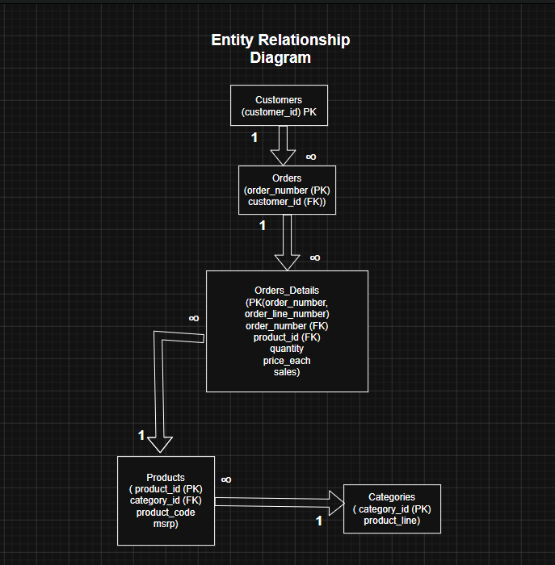
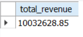
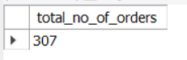
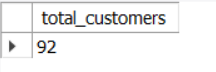
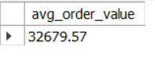
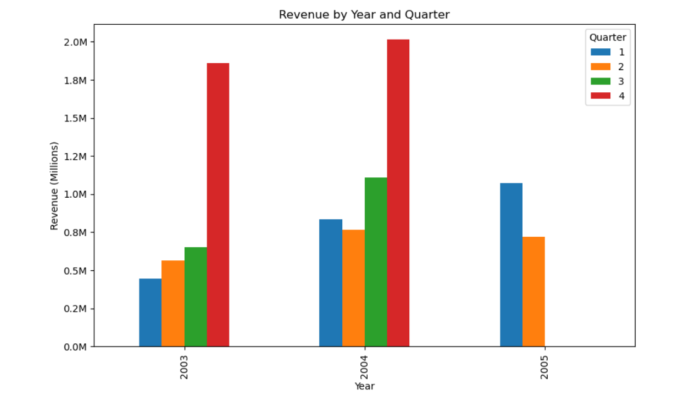
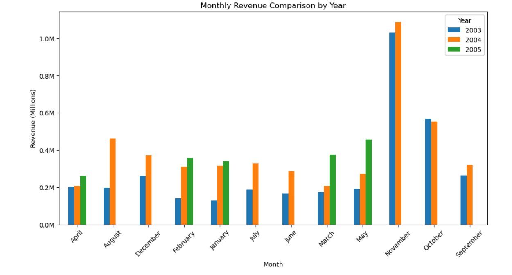
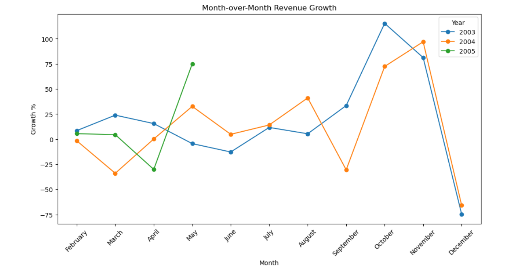

# Executive Dashboard Report

## Project Overview

The Executive Dashboard provides a high-level summary of the company's sales performance. It focuses on key performance indicators (KPIs) that help management monitor revenue, customer activity, sales trends, and geographical performance. The insights generated from this analysis can support strategic planning, resource allocation, and business decision-making.

---

## Database Schema

---

# Executive Summary

During the analysis period, the company generated **$10,032,628.85** in total revenue from **307 customer orders** placed by **92 active customers**.

The analysis reveals strong seasonal sales patterns, with **Quarter 4** consistently delivering the highest revenue. **2004** was the company's strongest-performing year, while the **United States** emerged as the largest revenue-generating market.

These findings can help management optimize inventory planning, marketing campaigns, and regional sales strategies.

---

# KPI Overview

| KPI | Result |
|------|--------|
| Total Revenue | **$10,032,628.85** |
| Total Orders | **307** |
| Active Customers | **92** |
| Average Order Value | **$32,679.57** |

### Visualization

---

# KPI 5 – Annual Revenue Performance

### Visualization

### Findings

- 2004 generated the highest annual revenue.
- Revenue increased significantly compared to 2003.
- 2005 contains only partial-year data.

### Business Recommendation

- Analyze the business strategies implemented during 2004.
- Replicate successful marketing campaigns and sales initiatives where possible.

---

# KPI 6 – Quarterly Revenue Performance

### Visualization

### Findings

- Quarter 4 consistently generated the highest revenue in completed years.
- The business experiences clear seasonal demand.

### Business Recommendation

- Increase inventory before Q4.
- Allocate additional marketing budget before the holiday season.
- Prepare staffing and logistics for higher sales volumes.

---

# KPI 7 – Monthly Revenue Performance

### Visualization

### Findings

- October and November consistently generated the highest monthly revenue.
- Revenue peaks during the final months of the year.

### Business Recommendation

- Launch promotional campaigns before October.
- Increase inventory availability for high-demand products.
- Plan warehouse capacity for peak sales months.

---

# KPI 8 – Monthly Revenue Trend

### Visualization

### Findings

- Monthly revenue fluctuates throughout the year.
- Revenue follows a repeating seasonal pattern.

### Business Recommendation

- Monitor monthly revenue continuously to identify unexpected sales declines.
- Use historical trends to improve sales forecasting.

---

# KPI 9 – Month-over-Month Sales Growth

### Visualization

### Findings

- Sales growth varies throughout the year.
- Some months experienced positive growth while others declined.
- Growth trends help identify changing customer demand.

### Business Recommendation

- Investigate months with declining sales.
- Evaluate promotional campaigns during high-growth months.
- Monitor growth percentage regularly as an early warning indicator.

---

# KPI 10 – Revenue Contribution by Country

### Visualization

### Findings

- The United States generated the highest revenue.
- France is the company's second-largest market.
- Revenue is concentrated in a few high-performing countries.

### Business Recommendation

- Continue investing in the United States.
- Expand marketing efforts in France.
- Identify opportunities to grow sales in lower-performing regions.

---

# Overall Business Findings

- Generated more than **$10 Million** in total revenue.
- Successfully processed **307 customer orders**.
- Served **92 active customers**.
- Achieved an average order value of **$32,679.57**.
- **2004** was the highest revenue-generating year.
- **Quarter 4** consistently delivered the strongest sales performance.
- **October** and **November** emerged as the best-performing months.
- Revenue demonstrates a clear seasonal purchasing pattern.
- The **United States** remains the company's largest revenue-generating market.

---

# Strategic Recommendations

## Sales Strategy

- Increase promotional campaigns before Quarter 4.
- Focus marketing investments during October and November.
- Prepare seasonal sales campaigns based on historical trends.

## Inventory Planning

- Maintain higher inventory levels before seasonal demand peaks.
- Forecast inventory requirements using monthly sales trends.
- Reduce stock shortages during peak sales periods.

## Customer Strategy

- Improve customer retention through loyalty programs.
- Increase Average Order Value using cross-selling and product bundles.
- Identify high-value customers for targeted marketing campaigns.

## Geographic Expansion

- Continue investing in the United States, the highest-performing market.
- Expand marketing initiatives within France.
- Explore growth opportunities in lower-performing regions to diversify revenue sources.

---

