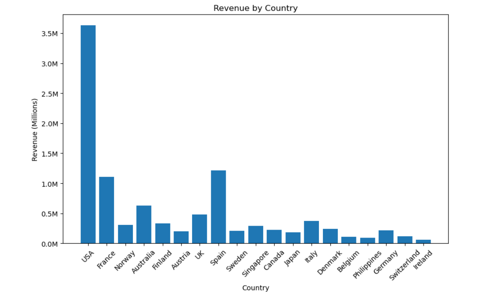
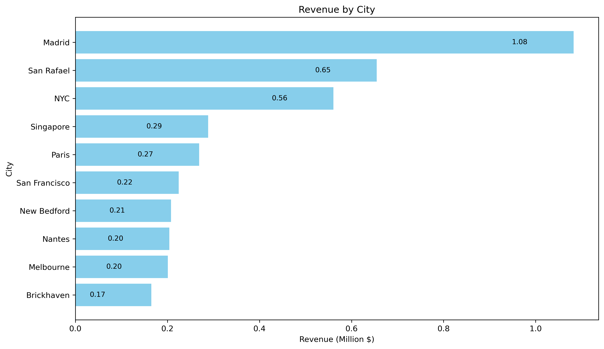
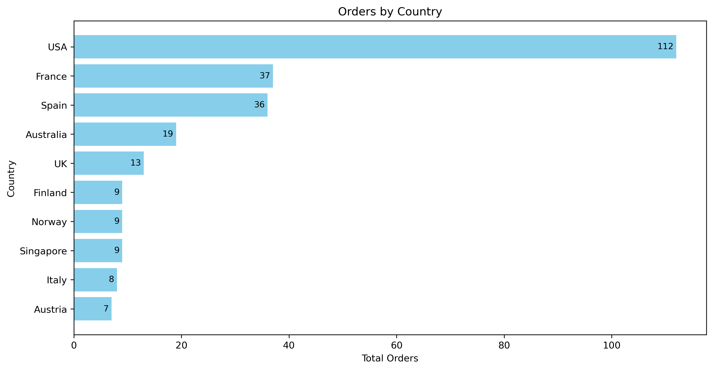
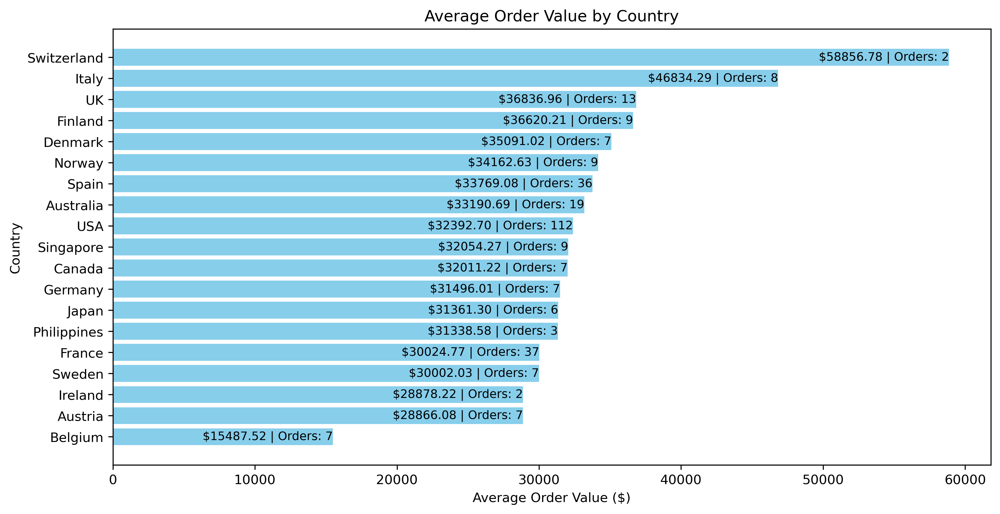
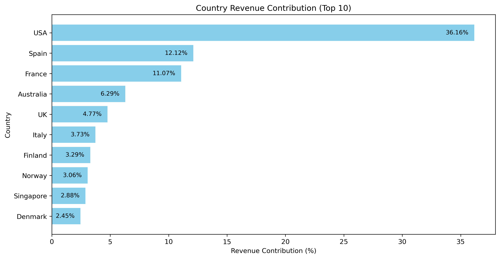

# Geographic Analysis Report

## Project Overview

The Geographic Analysis evaluates sales performance across different countries and cities to identify the company's strongest markets. This analysis helps management understand regional demand, customer purchasing behavior, and market contribution, enabling better expansion strategies and resource allocation.

The insights generated from this report support market prioritization, regional sales planning, and international business growth.

---

# Executive Summary

The company generated sales across multiple countries, with the **United States** contributing the highest revenue and order volume. **Madrid** emerged as the highest revenue-generating city, while **Switzerland** recorded the highest average order value despite having relatively few orders.

The analysis shows that revenue is concentrated within a few major markets, highlighting opportunities for both expansion and risk diversification.

---

# KPI 1 – Revenue by Country

### Visualization

> 

### Findings

- USA generated the highest revenue.
- Spain ranked second.
- France ranked third.
- Revenue is concentrated among a few major countries.

### Business Recommendation

- Continue investing in the United States.
- Expand marketing activities in Spain and France.
- Develop strategies to grow lower-performing markets.

---

# KPI 2 – Revenue by City

### Visualization

> 

### Findings

- Madrid generated the highest city-level revenue.
- Sales are concentrated in several key metropolitan areas.
- High-performing cities indicate strong customer demand.

### Business Recommendation

- Increase marketing investments in top-performing cities.
- Expand distribution networks around successful metropolitan markets.
- Replicate successful regional sales strategies in similar cities.

---

# KPI 3 – Orders by Country

### Visualization

> 

### Findings

- USA recorded the highest number of customer orders.
- Higher order volume indicates stronger customer activity.
- Countries with fewer orders may represent untapped growth opportunities.

### Business Recommendation

- Strengthen customer acquisition in low-order countries.
- Maintain customer engagement in high-volume markets.
- Use successful sales strategies from the USA as a benchmark.

---

# KPI 4 – Average Order Value by Country

### Visualization

> 

### Findings

- Switzerland recorded the highest average order value.
- Although order volume is low, customers place significantly larger purchases.
- High-value markets differ from high-volume markets.

### Business Recommendation

- Focus premium product offerings in high average order value markets.
- Encourage larger basket sizes through bundled promotions.
- Identify customer characteristics driving premium purchases.

---

# KPI 5 – Revenue Contribution by Country

### Visualization

> 

### Findings

- USA contributes approximately **36.16%** of total company revenue.
- Revenue dependency exists on a few major countries.
- Smaller markets collectively contribute the remaining company revenue.

### Business Recommendation

- Reduce dependency on a single market.
- Expand operations in emerging countries.
- Diversify revenue sources across additional geographic regions.

---

# Overall Business Findings

- USA is the company's highest revenue-generating country.
- Madrid is the highest revenue-generating city.
- USA records the largest order volume.
- Switzerland has the highest average order value.
- Revenue is concentrated among a limited number of countries.
- Significant opportunities exist for international market expansion.

---

# Strategic Recommendations

## Market Expansion

- Expand sales efforts in growing international markets.
- Increase regional marketing investments.
- Prioritize expansion into countries with growing customer demand.

## Sales Strategy

- Develop country-specific promotional campaigns.
- Customize product offerings based on regional purchasing behavior.
- Strengthen relationships in high-value markets.

## Revenue Diversification

- Reduce dependency on the United States.
- Grow sales in secondary markets such as Spain and France.
- Identify new international growth opportunities.

## Regional Planning

- Improve inventory allocation based on regional demand.
- Optimize logistics for high-performing markets.
- Monitor geographic performance regularly using dashboard reports.

---

