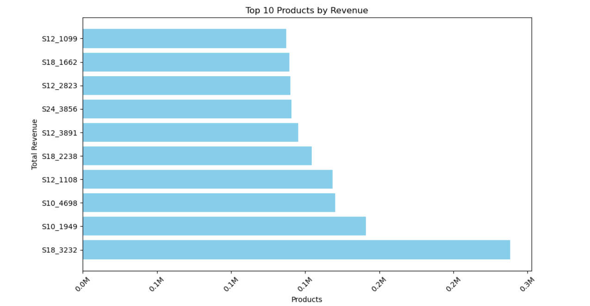
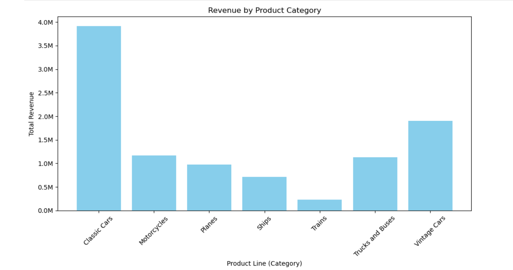
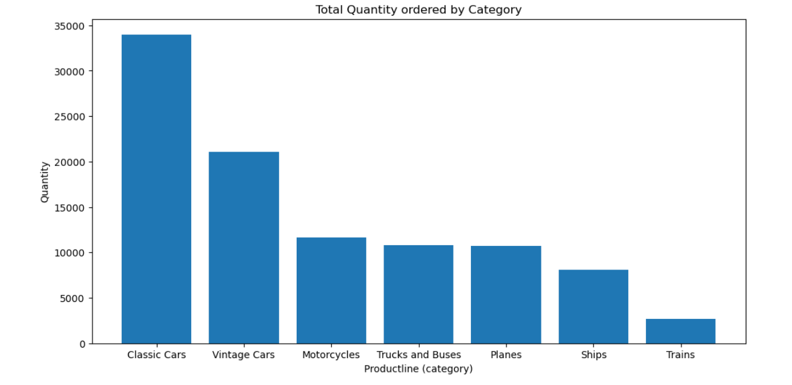
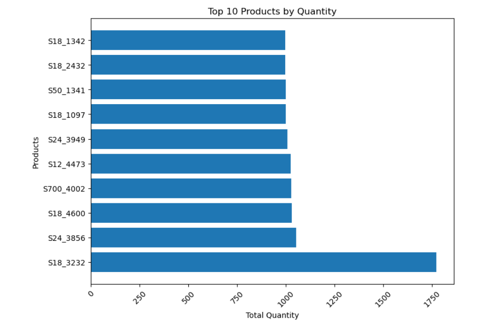
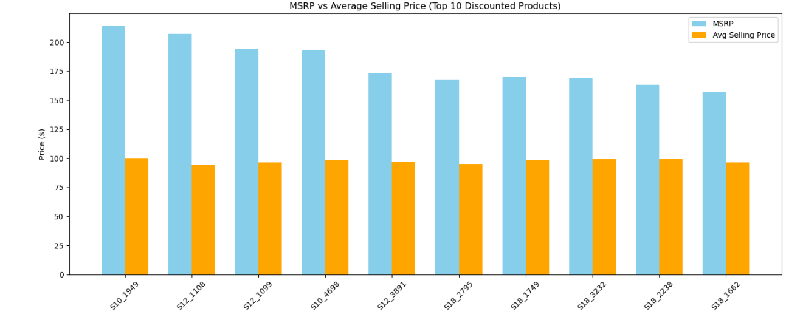
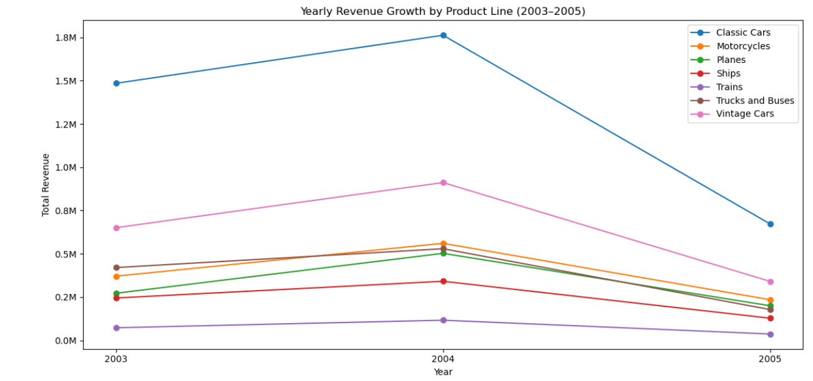
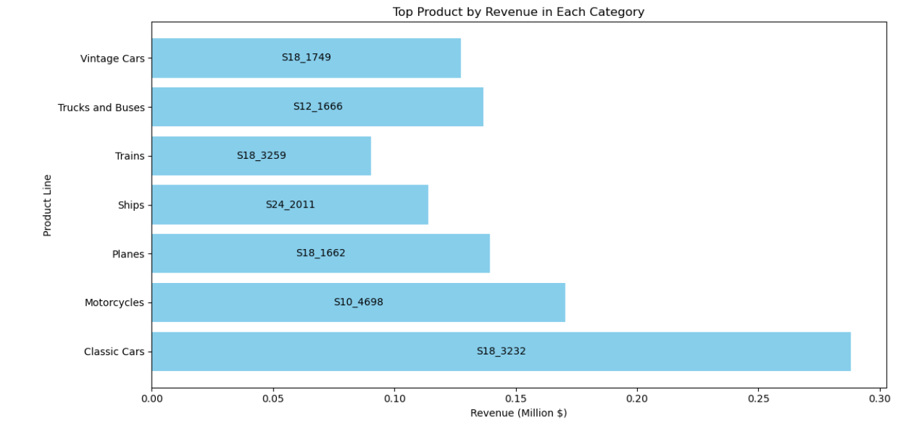
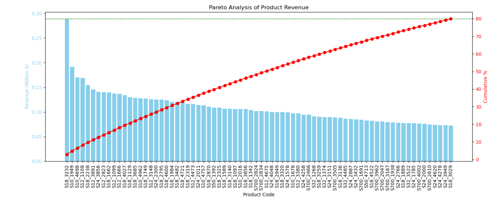
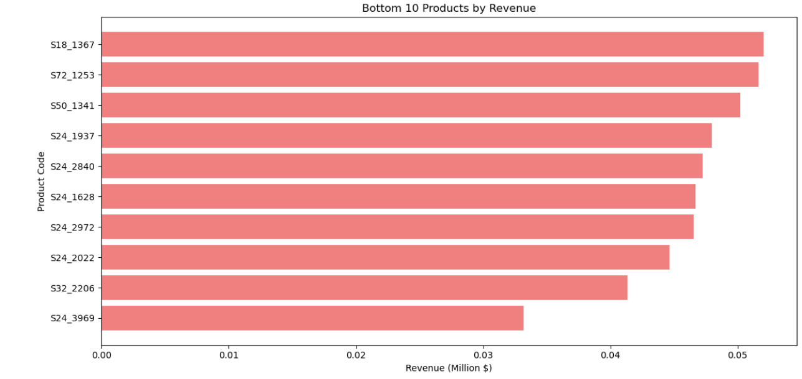
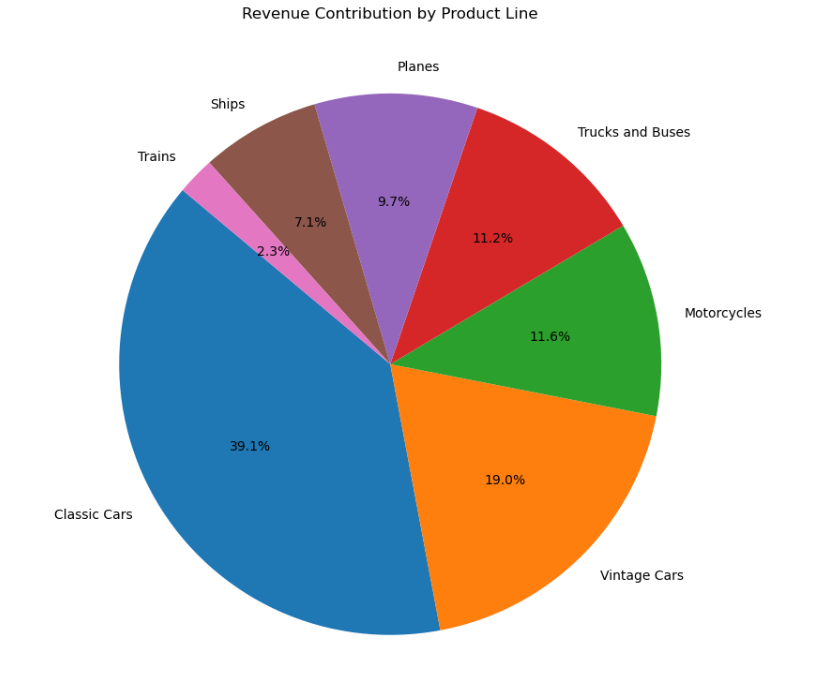

# Product Performance Report

## Project Overview

The Product Performance Analysis evaluates how individual products and product categories contribute to the company's sales performance. The analysis identifies the highest revenue-generating products, best-selling categories, pricing strategies, and product contribution to overall revenue.

The insights from this report help management optimize inventory planning, pricing decisions, marketing investments, and product portfolio management.

---

# Executive Summary

The analysis shows that a relatively small number of products generate the majority of company revenue, with **Classic Cars** emerging as the strongest-performing product category.

The company follows a discount-based pricing strategy, as products are generally sold below their MSRP. Product demand is also concentrated within a few high-performing products and categories, making inventory optimization and product prioritization essential for future business growth.

---

# KPI 1 – Highest Revenue Generating Products

### Visualization

> 

### Findings

- Product Code **(Insert Product Code)** generated the highest revenue.
- A few products account for a significant portion of total company revenue.
- Revenue is concentrated among the top-performing products.

### Business Recommendation

- Continue promoting top revenue-generating products.
- Ensure sufficient inventory for flagship products.
- Bundle high-performing products with slower-moving items.

---

# KPI 2 – Revenue by Product Category

### Visualization

> 

### Findings

- **Classic Cars** generated the highest revenue.
- Product revenue is concentrated within a few categories.

### Business Recommendation

- Continue investing in high-performing categories.
- Review marketing strategies for lower-performing categories.
- Expand successful product lines.

---

# KPI 3 – Quantity Sold by Product Category

### Visualization

> 

### Findings

- Classic Cars recorded the highest sales volume.
- Customer demand is strongest for selected product categories.

### Business Recommendation

- Maintain higher inventory levels for high-demand categories.
- Improve demand forecasting using historical sales data.

---

# KPI 4 – Highest Selling Products (Quantity)

### Visualization

> 

### Findings

- A small number of products dominate total sales quantity.
- Best-selling products are consistent with revenue leaders.

### Business Recommendation

- Prioritize replenishment of high-demand products.
- Reduce stock-out risk during peak demand periods.

---

# KPI 5 – Average Selling Price vs MSRP

### Visualization

> 

### Findings

- Products are generally sold below MSRP.
- Discount levels vary across different products.
- Some products receive significantly larger discounts than others.

### Business Recommendation

- Review heavily discounted products to improve profitability.
- Evaluate whether discounting increases sales volume sufficiently.
- Consider dynamic pricing strategies for premium products.

---

# KPI 6 – Product Category Performance Over Time

### Visualization

> 

### Findings

- Product category performance changes across different months and years.
- Some categories display clear seasonal demand patterns.

### Business Recommendation

- Increase inventory before seasonal demand peaks.
- Allocate marketing budgets based on historical category performance.

---

# KPI 7 – Best Performing Product in Each Category

### Visualization

> 

### Findings

- Every category has one dominant product driving category revenue.
- Revenue distribution within categories is uneven.

### Business Recommendation

- Promote flagship products within each category.
- Cross-sell complementary products alongside category leaders.

---

# KPI 8 – Pareto Analysis (80/20 Rule)

### Visualization

> 

### Findings

- Approximately **74 products** contribute nearly **80%** of the company's revenue.
- Revenue follows the Pareto Principle, where a relatively small group of products drives most sales.

### Business Recommendation

- Prioritize inventory for Pareto products.
- Focus marketing campaigns on top revenue-generating products.
- Protect availability of high-contributing products during peak seasons.

---

# KPI 9 – Lowest Revenue Generating Products

### Visualization

> 

### Findings

- Several products generate minimal revenue.
- These products contribute little to total company sales.

### Business Recommendation

- Review pricing and promotional strategies.
- Consider discontinuing consistently underperforming products.
- Investigate whether low sales result from poor visibility or low demand.

---

# KPI 10 – Revenue Contribution by Product Category

### Visualization

> 

### Findings

- Revenue contribution is heavily concentrated within a few product categories.
- Classic Cars contribute the largest share of company revenue.

### Business Recommendation

- Continue investing in top-performing categories.
- Diversify revenue by strengthening weaker categories.
- Monitor category contribution regularly to reduce dependency risk.

---

# Overall Business Findings

- Revenue is concentrated among a relatively small number of products.
- Classic Cars dominate both revenue and sales volume.
- Best-selling products consistently outperform the rest of the portfolio.
- Most products are sold below MSRP, indicating a discount-driven pricing strategy.
- Approximately 80% of company revenue is generated by a subset of products.
- Several products contribute very little revenue and require business review.

---

# Strategic Recommendations

## Product Strategy

- Focus inventory investment on high-performing products.
- Expand successful product lines.
- Monitor underperforming products for discontinuation.

## Pricing Strategy

- Review discount policies.
- Reduce unnecessary discounting on premium products.
- Implement data-driven pricing decisions.

## Inventory Management

- Prioritize stock for Pareto products.
- Improve forecasting using historical demand patterns.
- Prevent stock shortages for best-selling products.

## Marketing Strategy

- Increase promotion for flagship products.
- Bundle slow-moving products with top sellers.
- Allocate budgets toward high-performing product categories.

---

