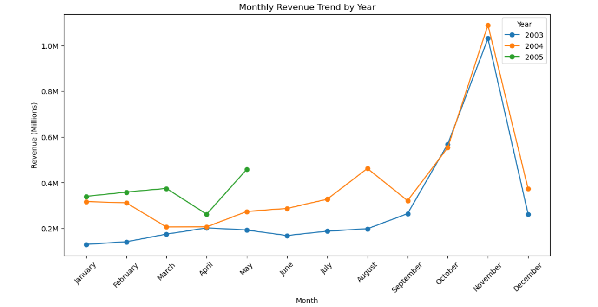
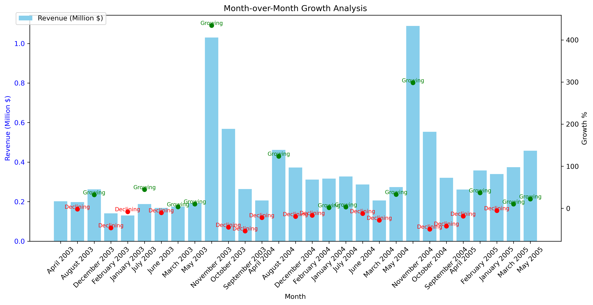
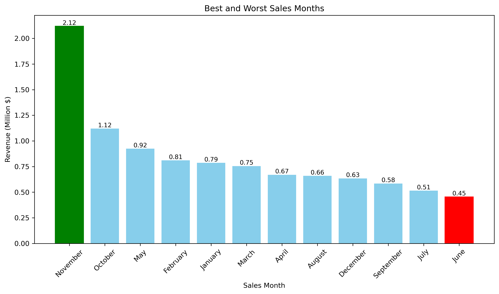
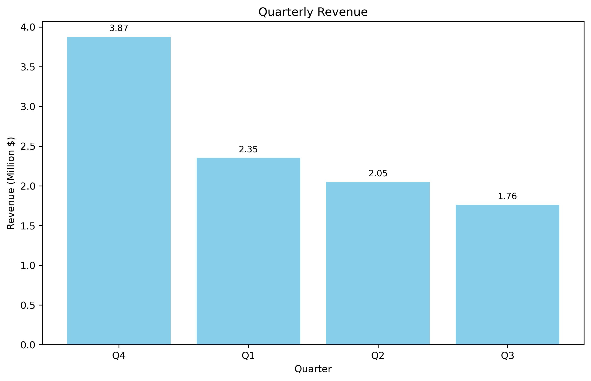
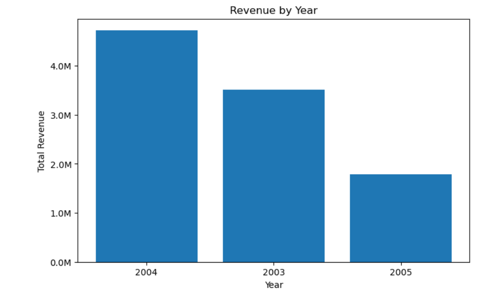

# Time Analysis Report

## Project Overview

The Time Analysis evaluates how sales performance changes over different time periods. It focuses on monthly trends, growth patterns, seasonality, quarterly performance, and annual revenue to help management understand business cycles and improve forecasting.

This analysis enables better inventory planning, marketing campaign scheduling, and long-term strategic decision-making.

---

# Executive Summary

Sales exhibit a clear seasonal pattern, with **Quarter 4** consistently generating the highest revenue. Monthly revenue fluctuates throughout the year, indicating periods of both growth and decline. **2004** was the strongest-performing year, demonstrating significant business growth compared to previous years.

Understanding these trends helps management prepare for peak demand periods while addressing slow-performing months through targeted business initiatives.

---

# KPI 1 – Monthly Revenue Trend

### Visualization

> 

### Findings

- Monthly revenue varies throughout the year.
- Revenue generally increases toward the end of each year.
- Seasonal demand is clearly visible.

### Business Recommendation

- Monitor monthly performance regularly.
- Use historical monthly trends for revenue forecasting.
- Prepare inventory before expected demand increases.

---

# KPI 2 – Month-over-Month Revenue Growth

### Visualization

> 

### Findings

- Revenue experiences both positive and negative monthly growth.
- Growth percentages highlight business expansion and slowdown periods.
- Some months consistently outperform previous months.

### Business Recommendation

- Investigate months with declining sales.
- Analyze successful campaigns during high-growth months.
- Use growth trends as an early warning indicator.

---

# KPI 3 – Best & Worst Sales Months

### Visualization

> 

### Findings

- October and November consistently generate the highest revenue.
- Some months contribute significantly less revenue.
- Strong seasonal buying behavior exists.

### Business Recommendation

- Increase promotional activities before peak months.
- Improve sales strategies during low-performing months.
- Align inventory planning with seasonal demand.

---

# KPI 4 – Quarterly Revenue Analysis

### Visualization

> 

### Findings

- Quarter 4 generated the highest revenue.
- Quarter 1 and Quarter 2 produced comparatively lower sales.
- Business performance improves significantly during year-end.

### Business Recommendation

- Increase production and inventory before Quarter 4.
- Allocate larger marketing budgets during the final quarter.
- Plan staffing requirements for seasonal demand.

---

# KPI 5 – Year-over-Year Revenue Analysis

### Visualization

> 

### Findings

- 2004 generated the highest annual revenue.
- Revenue improved considerably compared to 2003.
- 2005 contains only partial-year data.

### Business Recommendation

- Study the business strategies that contributed to 2004's success.
- Continue monitoring annual growth trends.
- Establish yearly revenue targets using historical performance.

---

# Overall Business Findings

- Sales demonstrate strong seasonality.
- Revenue increases toward the end of the year.
- Quarter 4 consistently outperforms other quarters.
- October and November are the strongest sales months.
- Month-over-month growth highlights both expansion and slowdown periods.
- 2004 was the company's highest revenue-generating year.

---

# Strategic Recommendations

## Sales Planning

- Schedule major promotional campaigns before Quarter 4.
- Focus marketing investments during October and November.
- Improve campaigns during historically weak months.

## Inventory Planning

- Increase stock levels before seasonal demand peaks.
- Use monthly revenue forecasts for procurement planning.

## Revenue Forecasting

- Monitor month-over-month growth regularly.
- Build sales forecasts using historical seasonal trends.
- Identify early signs of declining revenue.

## Business Strategy

- Replicate successful initiatives from the highest-performing year.
- Review low-performing months to identify improvement opportunities.
- Continuously evaluate seasonal customer buying behavior.

---

# Project Completion

This concludes the Sales Analytics SQL Project, covering:

- Executive Dashboard Analysis
- Product Performance Analysis
- Customer Analysis
- Geographic Analysis
- Time Analysis

The project provides a comprehensive view of sales performance through business-oriented SQL analysis and supports strategic decision-making using data-driven insights.